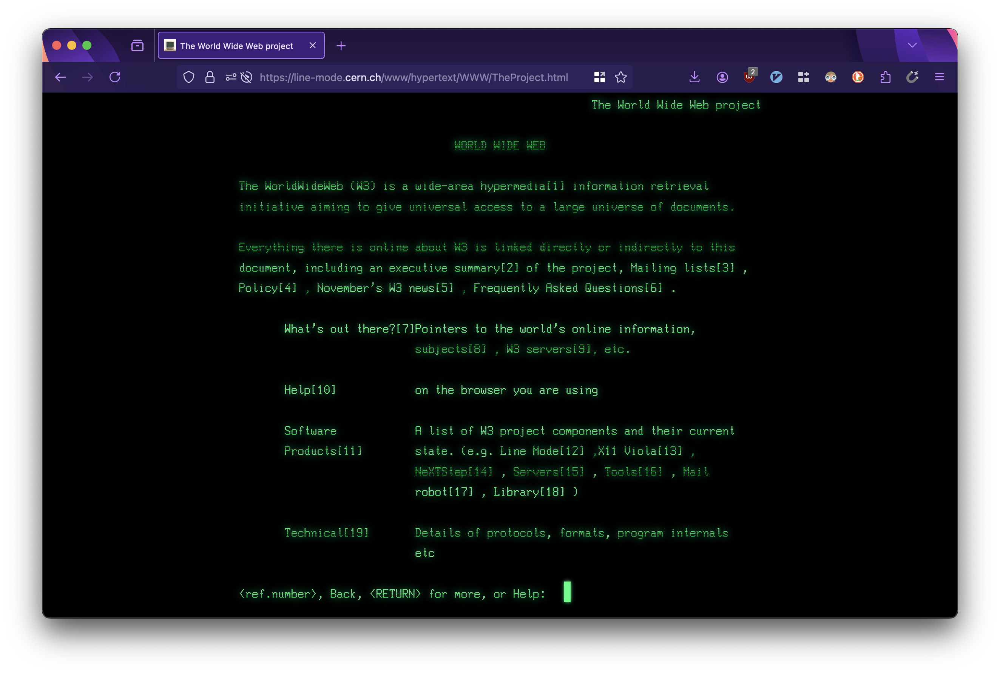

# Line Mode Browser
  
> The line-mode browser, launched in 1992, was the first readily accessible1 browser for what we now know as the world wide web. It was not, however, the world’s first web browser. The very first web browser was called WorldWideWeb and was created by Tim Berners-Lee in 1990.

This repository holds a mirror of CERN's Line Mode Browser simulation.

The live website is found at: https://line-mode.cern.ch/

The main repository is found at: https://gitlab.cern.ch/web-team/html-websites/line_mode/

# Requirements

- NodeJS

# Install

1. Clone this repository
2. Run `node .`
3. Open http://localhost:8000/ in your browser

# Contribute

Add your HTML, CSS, and JavaScript to `./public`. You can make a proxy call by requesting anything at `./proxy?url=http://example.com`.
